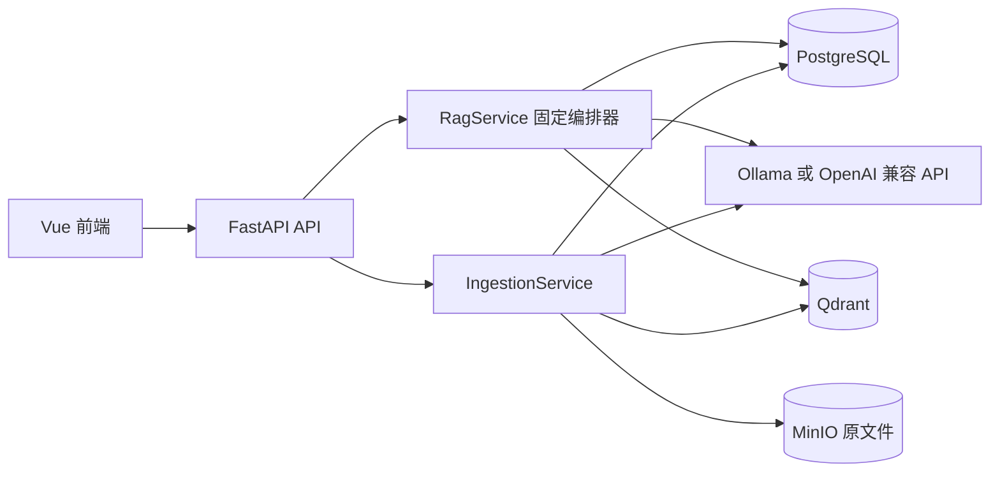
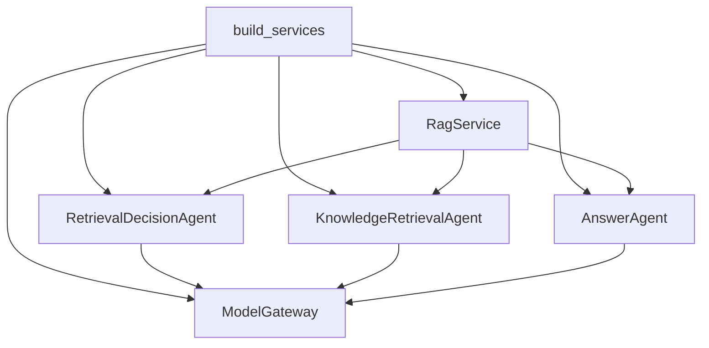
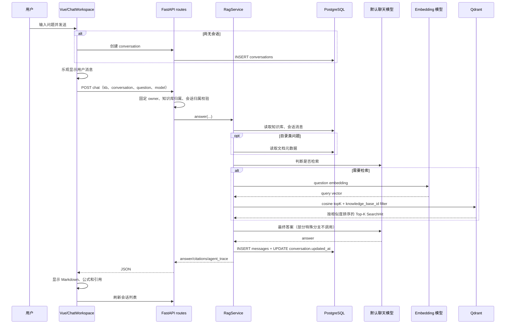

# RAG 项目运行机制与代码分析

本文以当前代码为准，不以设计文档中的旧流程为准。当前实现由应用层固定编排三阶段链路：

```text
RetrievalDecisionAgent
  -> KnowledgeRetrievalAgent（按需）
  -> AnswerAgent
```

核心结论：这些 Agent 不是能互相发消息、自由选工具的自治 Agent。它们是三个普通 Python 对象，由 `RagService.answer()` 依次调用；前一个对象的返回值由 `RagService` 转换后传给下一个对象。

## 1. 总体架构



- PostgreSQL：知识库、文档状态、chunk 元数据、会话、问答记录、引用。
- MinIO：上传的原始文件。正常问答时不会读取 MinIO。
- Qdrant：chunk 向量和可直接回答所需的 payload，包括正文、路径、页码等。
- Ollama/远程 API：聊天补全和 embedding。模型服务自身不承担项目记忆。
- 浏览器：维护当前 UI 状态、附件解析结果和未完成导入队列；不是权威数据源。

## 2. 大模型的上下文记忆如何实现

### 2.1 持久记忆

`messages` 表每行保存一轮完整问答：`question`、`answer`、`citations`，并通过 `conversation_id` 归属会话（`backend/src/rag_app/infrastructure/postgres/schema.py:58`）。回答成功后，`RagService` 才调用 `add_message()` 写入这一轮（`backend/src/rag_app/application/rag_service.py:92`）。

读取时，`PostgresRepository.list_messages()` 将一行重新展开为两条消息：

```text
{role: user, content: question}
{role: assistant, content: answer, citations: [...]}
```

对应代码为 `backend/src/rag_app/infrastructure/postgres/repository.py:217`。数据库记录会一直保留，直到删除会话或知识库。

### 2.2 本轮工作记忆

每次回答先读取该会话的全部消息，然后在 Python 侧取最后 12 条角色消息（`rag_service.py:43`）：

```python
history = repository.list_messages(conversation_id)[-12:]
```

因为一次历史问答会展开为 user + assistant 两条，所以通常相当于最近 6 轮问答。该 `history` 被同时用于：

1. 检索决策和查询改写：让模型判断是否需要新检索，并补全“它、上面那个文件”等指代。
2. 目录问题的文件夹指代回溯：当前问题没写出文件夹时，从更早的 user 消息倒序寻找。
3. 最终答案生成：历史按原 role 拼入最终聊天消息。

最终 prompt 顺序是（`agent/answer_agent.py:19`）：

```text
system: 回答约束
history 中的 user/assistant 消息（最多 12 条）
system: 本轮检索片段 + 临时附件 + 目录元数据组成的 JSON
user: 当前问题
```

### 2.3 它没有实现的“记忆”

- 没有模型 KV cache、服务端模型 session 或隐藏状态复用；每轮都重新发送历史。
- 没有对旧会话做摘要，也没有长期记忆抽取。
- 没有对会话历史做向量化或语义检索。
- 历史引用保存在数据库和前端，但传给模型时只传 `role/content`，不传历史 citation 结构。
- 只限制历史消息条数，不限制历史总 token/字符；附件正文仍由 API 的固定请求安全上限限制。
- 失败的请求不会写入记忆，因为写库发生在答案成功生成之后。

### 2.4 临时附件的记忆边界

附件正文只进入当前请求的 `temporary_attachment_context`。持久化时保存的是“原问题 + 附件名”、答案和附件 citation，不保存临时附件正文。因此下一轮模型只能看到上一轮的问题、附件名和答案，看不到附件原文。只有勾选“保存到当前知识库”并成功完成文档入库后，附件正文才可能在未来通过 Qdrant 被重新检索。

## 3. Agent 之间如何联系

### 3.1 对象装配

`build_services()` 创建一个模型网关、一个 Qdrant 存储对象和三个 Agent，再全部注入 `RagService`（`backend/src/rag_app/main.py`）。三个 Agent 共享同一个 `models` 对象，但没有共享可变“记忆板”。



### 3.2 实际数据传递

1. `DecisionAgent.run(question, history)` 返回是否需要检索。
2. 若需检索，`RetrievalAgent.run(knowledge_base, question)` 将问题 embedding 后调用 Qdrant，直接返回按 cosine 相似度排序的前 `RAG_TOP_K` 个 `SearchHit`。
3. `AnswerAgent.run()` 接收这些原始 hits、历史、目录和附件，生成唯一的用户答案。
4. `RagService` 生成 citation、写数据库并返回 `agent_trace`。

因此，“Agent 通信协议”就是 Python 方法参数、dataclass 和 `SearchHit` 协议，不是 HTTP、队列、WebSocket 或 Agent 间自然语言会话。

### 3.3 模型选择的一个细节

用户在前端选择的 `model` 只传给 `AnswerAgent`；检索使用网关配置的 embedding 模型。

## 4. 检索之前会发生什么

从用户点击发送到真正调用 embedding 之前，顺序如下：

1. 若当前没有会话，前端以问题前 50 个字符创建会话。
2. 前端立即把用户消息作为 pending 消息放入页面。
3. 若有附件，附件早在发送前已经通过 `/chat-attachments/parse` 解析；发送时上传解析后的 context，而不是重新传文件。
4. API 使用固定的 `OWNER_ID` 筛选知识库；当前不提供登录或客户端身份校验。
5. API 校验 `conversation_id` 存在且属于当前知识库。
6. `RagService` 读取知识库记录，随后读取会话历史并取最后 12 条。
7. 代码正则判断问题是否涉及目录/文件清单。若涉及，先从 PostgreSQL 读取所有文档元数据并生成目录上下文。
8. 若是纯文件清单/计数问题，代码直接生成确定性 Markdown 答案，并让决策 Agent 跳过检索。
9. 若是助手身份/模型问题，也直接跳过检索。
10. 其他问题调用 `RetrievalDecisionAgent`：将历史和当前问题发给默认聊天模型，请它输出 `RETRIEVE/SKIP`。
11. 解析模型 JSON；只有明确的 `SKIP` 才跳过。空输出、格式异常或不确定都会保守地进入检索。
12. 需要检索时，直接使用当前问题进入 embedding 和 Qdrant 查询，不使用词法补召回或查询后的 LLM 重排。

到第 12 步结束后，才进入 query embedding 和 Qdrant 查询。

## 5. 文档怎样变成可检索知识

问答检索依赖预先完成的入库流程（`backend/src/rag_app/application/ingestion_service.py:86`）：

1. 校验知识库和 embedding 模型是否一致。
2. 规范化文件名与文件夹路径，阻止 `..`，检查同路径同名文件重复。
3. 将原文件流写入 MinIO：`{kb_id}/{document_id}/source/{file_name}`。
4. 在 PostgreSQL 创建 `processing` 文档记录。
5. 根据文件类型解析文本。
6. `_chunk_sources()` 以页、幻灯片、工作表和解析器章节为硬边界，并识别 Markdown、中文编号标题及 DOCX Heading 层级；章节内优先在段落、行、句子或空白边界切分，只有无自然边界的长文本才退回固定字符窗口。
7. 每个 chunk 的 embedding 输入不是纯正文，而是：完整路径、文件名、后缀、正文。这提高按文件名/路径检索的机会。
8. embedding 默认每批 32 个；服务端 semaphore 默认允许两个入库、embedding 单并发。
9. Qdrant 使用 cosine collection，point payload 保存 chunk ID、知识库 ID、文档 ID、路径、页码、正文等。
10. PostgreSQL 保存一份 chunk 元数据和确定性 Qdrant point ID，最后把文档设为 `ready`。
11. 任一步失败会清理该文档的 Qdrant points，并把 PostgreSQL 文档标为 `failed`；MinIO 原文件仍保留，便于定位失败，但当前代码没有自动重试。

## 6. 实际怎样检索

### 6.1 单路向量相似度检索

`KnowledgeRetrievalAgent` 先检查知识库建库时的 embedding 模型是否等于当前网关模型，避免用不同向量空间查询旧索引。然后：

```text
question -> embedding -> Qdrant cosine query
             -> filter knowledge_base_id
             -> top RAG_TOP_K
```

Qdrant 结果已携带全文和引用元数据，所以问答阶段不再访问 PostgreSQL 的 `document_chunks`，也不读取 MinIO。Qdrant 返回顺序就是最终上下文顺序，`KnowledgeRetrievalAgent` 只做 `top_k` 的边界保护。

当前没有宽召回、BM25、sparse vector、RRF、关键词召回或精确文件名过滤，属于单路 dense retrieval。

### 6.2 最终回答与引用

有证据时，`AnswerAgent` 把 Qdrant 返回的原始 chunks 放入只读 JSON system message，再调用回答模型。无证据但本轮执行过检索且没有附件时，直接返回“知识库中无相关内容。”，不再调用回答模型。

返回的 citation 是“进入最终上下文的片段来源”，包括 Qdrant cosine `score`；`relevance_score` 保留为 `null` 以兼容已有客户端，不再执行 LLM 评分。它不是逐句 claim-to-source 对齐，也不能证明回答实际使用了每个 citation。

## 7. 用户提问一次后完整发生什么



常见单轮模型调用次数：

| 分支 | 聊天模型调用 | Embedding | Qdrant |
| --- | ---: | ---: | ---: |
| 身份/所用模型 | 0 | 0 | 0 |
| 纯文件清单/计数 | 0 | 0 | 0 |
| 问候或基于历史改写 | 2：决策 + 回答 | 0 | 0 |
| 检索但没有候选 | 1：决策 | 1 | 1 |
| 正常回答（有或无候选） | 2：决策 + 回答 | 1 | 1 |

决策使用默认聊天模型，只有最后的回答使用用户所选模型；embedding 使用知识库绑定的 embedding 模型。

## 8. 关键容错与安全边界

- 检索决策异常：默认检索，避免误跳过知识。
- Prompt injection：回答 prompt 说明文档内容是只读证据，不执行其中指令；但这仍是 prompt 级防护，不是形式化隔离。
- 结构化输出：Ollama 收到完整 JSON schema；OpenAI 兼容网关只请求 `json_object`，若服务不支持还会去掉该参数重试，最终靠本地解析兜底。
- 数据范围：API 通过环境变量 `OWNER_ID` 只访问固定 owner 的知识库，但不验证访问者身份；这不是多用户/OIDC/RBAC 实现。
- 同步执行：聊天和文档入库都在 HTTP 请求内同步完成，没有后台 worker、任务队列、流式答案或 SSE。

## 9. 每个源码文件的功能

### 9.1 `agent/`

| 文件 | 功能 |
| --- | --- |
| `agent/contracts.py` | 定义 Agent 依赖的最小 `SearchHit`、`ModelGateway`、`VectorStore` Protocol，隔离具体基础设施。 |
| `agent/query_intent.py` | 用正则识别助手身份、目录元数据需求、纯文件清单问题，提供无需模型的快速分支。 |
| `agent/context.py` | 统一文件路径和检索上下文格式；生成有长度上限的目录描述；对纯清单问题生成确定性 Markdown。 |
| `agent/retrieval_decision_agent.py` | 用历史判断 RETRIEVE/SKIP；解析异常时默认检索。 |
| `agent/knowledge_retrieval_agent.py` | 校验 embedding 模型，将当前问题向量化并调用 Qdrant 返回 `RAG_TOP_K` 个近邻 chunks。 |
| `agent/answer_agent.py` | 处理身份/目录/无相关内容等确定性分支；否则组装历史、证据、附件、目录并生成唯一答案。 |
| `agent/__init__.py` | 汇总导出公共 Agent、结果类型和 Protocol。 |

### 9.2 后端应用、领域和 API

| 文件 | 功能 |
| --- | --- |
| `backend/src/rag_app/main.py` | 应用 composition root：选择本地/远程模型，创建所有存储、服务和 Agent，启动检查、CORS、FastAPI lifespan。 |
| `backend/src/rag_app/config.py` | 从根目录 `.env` 读取端口、存储、模型、RAG Top-K、并发、固定 owner 和 CORS 配置。 |
| `backend/src/rag_app/cli.py` | 命令行递归导入本机文件夹；逐文件同步调用入库服务并报告成功/失败。 |
| `backend/src/rag_app/application/rag_service.py` | 全部 Agent 的确定性编排器；负责历史读取、目录分支、citation、消息持久化和 `agent_trace`。 |
| `backend/src/rag_app/application/ingestion_service.py` | 上传流大小/路径/重复校验，MinIO 保存、解析、分批 embedding、Qdrant upsert、PG 状态推进和失败清理。 |
| `backend/src/rag_app/application/deletion_service.py` | 按“Qdrant -> MinIO -> PostgreSQL”同步删除文档、文件夹或整个知识库。 |
| `backend/src/rag_app/domain/models.py` | `ParsedChunk`、`SearchHit`、`Citation` 不可变数据模型。 |
| `backend/src/rag_app/domain/ports.py` | Metadata/Object/Vector/Parser/Model 五类端口接口，定义应用层依赖边界。 |
| `backend/src/rag_app/domain/ids.py` | 用 UUIDv5 从 chunk ID 生成稳定 Qdrant point ID，支持幂等 upsert。 |
| `backend/src/rag_app/api/schemas.py` | Pydantic 请求校验：知识库、聊天、预解析附件、会话创建/改名。 |
| `backend/src/rag_app/api/routes.py` | 所有 HTTP 路由、固定 owner 范围校验、聊天与附件入口、上传/删除、会话 CRUD、错误码映射。 |
| 各目录 `__init__.py` | Python 包标记；除 OpenAI compatible 包导出 gateway 外基本为空。 |

### 9.3 后端基础设施

| 文件 | 功能 |
| --- | --- |
| `infrastructure/postgres/schema.py` | 建 knowledge base、document、chunk、conversation、message 表，执行旧消息会话迁移并建索引。 |
| `infrastructure/postgres/repository.py` | SQLAlchemy Core 仓储；实现元数据 CRUD、chunk 替换、会话和问答记录持久化。 |
| `infrastructure/qdrant/vector_store.py` | 创建 cosine collection、批量 upsert、按知识库向量查询、按文档/知识库 payload 删除。 |
| `infrastructure/minio/object_store.py` | 创建 bucket，流式上传/删除原始对象。 |
| `infrastructure/ollama/gateway.py` | 检查本地模型、列出聊天模型，映射 `/api/chat` 与 `/api/embed` 请求。 |
| `infrastructure/openai_compatible/gateway.py` | 调远程 `/chat/completions` 和 `/embeddings`，支持模型白名单、批量 embedding 和 JSON mode 降级。 |
| `infrastructure/parsing/document_parser.py` | 统一文件类型分派和 1800/240 字符切块；见下一小节。 |

`document_parser.py` 内部解析功能：

- PDF：`pypdf` 按页提取，保留页码。
- DOCX：`python-docx` 提取段落和表格；会修复指向缺失可选 UI 部件的坏 relationship。
- 旧 DOC/PPT：Windows 上通过独立 COM 线程调用 Word/PowerPoint，60 秒超时或失败后退回二进制可读字符串提取。
- PPTX：直接流式读取 ZIP 中每页 XML，按演示文稿 relationship 排序，不读取媒体资源，并限制单页 XML 大小。
- XLSX/XLS/CSV：只读工作簿/表格，按行输出制表符文本。
- JSON/XML/HTML：结构化解析后提取文本；HTML 使用标准库 `HTMLParser`。
- PTPT/JCPT/STPT：作为 ZIP 容器读取最多 200 个受支持文本条目，并限制单条和总解压大小。
- ATT/LST：识别 GeoMap LayerStyle/Album 专有二进制格式并解析结构；否则按无扩展名或普通文本处理。
- DLL/GDB/未知二进制：提取 ASCII、UTF-16LE、GB18030 可读字符串并限制总字符量。
- 无扩展名：先判断纯文本，再判断 ZIP，最后走二进制提取。

### 9.4 前端

| 文件 | 功能 |
| --- | --- |
| `frontend/src/main.js` | 创建 Vue 应用、注册 Pinia、加载 KaTeX 和全局样式。 |
| `frontend/src/App.vue` | 应用初始化、知识库选择、文档/聊天页签、文档状态轮询、知识库/文档删除总布局。 |
| `frontend/src/services/api.js` | fetch 封装和全部后端业务 API 函数。 |
| `frontend/src/stores/knowledgeBase.js` | Pinia 知识库/文档状态；合并相同文档列表请求，处理选择、创建和删除。 |
| `frontend/src/components/ChatWorkspace.vue` | 会话列表/改名/删除、模型选择、附件预解析、发送、乐观消息、答案 Markdown/citation 展示。 |
| `frontend/src/components/ImportPanel.vue` | 选择文件/目录、过滤类型和系统文件、两并发上传、文件夹队列、sessionStorage 中断提示。快照不含 File 内容，刷新后必须重新选择。 |
| `frontend/src/components/DocumentList.vue` | 将扁平文档按 `folder_path` 组装成树形表格，汇总状态/chunk 数，提供文档和目录删除。 |
| `frontend/src/components/KnowledgeSidebar.vue` | 知识库列表、选择、折叠、刷新、新建和删除入口。 |
| `frontend/src/components/CreateKnowledgeBaseDialog.vue` | 知识库名称/描述输入和提交事件。 |
| `frontend/src/components/DeleteConfirmDialog.vue` | 通用不可撤销删除确认框。 |
| `frontend/src/utils/markdown.js` | 修正常见 LaTeX 定界符，使用 marked + KaTeX 渲染，再用 DOMPurify 清洗 HTML。 |
| `frontend/src/styles.css` | 全局布局、响应式、聊天、表格、导入、对话框、Markdown/KaTeX 视觉样式。 |
| `frontend/src/utils/markdown.test.js` | 验证公式定界符修复且不改写普通括号、行内代码和代码块。 |

### 9.5 启动、依赖、文档和生成文件

| 文件 | 功能 |
| --- | --- |
| `run_all.py` | 检查 8080/5173 端口，启动 Docker 三服务、Uvicorn 和 Vite，并统一清理子进程。 |
| `run_all.cmd` | Windows 双击入口，切到项目根目录后执行 `run_all.py`。 |
| `scripts/start-local.ps1` | 只启动 Docker 基础设施和后端。 |
| `scripts/start-server.sh` | 在 Linux 服务器启动原生 PostgreSQL、Qdrant、MinIO，并用 Conda 环境统一看护 8080 后端和 6008 前端。 |
| `docker-compose.yml` | PostgreSQL 16、Qdrant 1.14.1、MinIO 及持久卷。 |
| `.env.example` | 无密钥的配置模板；实际 `.env` 被 gitignore。 |
| `requirements.txt` / `backend/pyproject.toml` | Python 运行依赖和包元数据。 |
| `frontend/package.json` / `vite.config.js` / `index.html` | 前端依赖、脚本、Vite 固定端口和 HTML 壳。 |
| `frontend/package-lock.json` | npm 锁文件，固定完整依赖树，不包含业务逻辑。 |
| `backend/src/rag_knowledge_assistant.egg-info/*` | setuptools 生成的包元数据，不是运行时业务代码。 |
| `docs/*.md` | 架构与权限设计；包含未来目标，不能全部视为已实现。 |
| `backend/tests/*.py` | 后端单元/路由测试，覆盖 Agent 兜底、网关参数、入库、解析、删除、公开路由、会话和 RAG 编排。 |
| `figures/*`、`*.docx` | 示例/报告资产，不参与应用运行。 |
| `*-server.log`、`.tmp-*`、`frontend/dist` | 运行或构建产物，不属于源码调用链。 |

## 10. 当前实现与文档/理想架构的差异及风险

1. **设计文档过时**：部分旧设计仍描述宽召回、相关性评分和上下文压缩，代码当前采用单路向量 Top-K。
2. **不是自治 Agent**：没有规划器、工具循环、Agent-to-Agent 消息或并行执行；“Agent”在这里更接近有独立 prompt 的处理阶段。
3. **上下文预算不完整**：检索 chunks 不再做 RAG 字符数压缩，只限制附件请求的固定大小；长历史、目录和多个 chunks 仍可能超过模型上下文窗口。
4. **历史查询低效**：数据库每轮取出会话全部消息，再在 Python 中 `[-12:]`；长会话应在 SQL 中倒序 limit 后恢复正序。
5. **附件不具备跨轮原文记忆**：临时正文不持久化，后续只能依赖上一轮答案或重新上传/入库。
6. **所选模型只影响最终回答**：用户可能以为 embedding 也随聊天模型切换，实际 embedding 使用知识库绑定的 embedding 配置。
7. **仅 dense 检索**：专业文件名、编号、精确术语可能需要 BM25/sparse/hybrid；当前 Top-K 无法找回向量漏召回内容。
8. **引用不是逐句引用**：citation 代表输入证据集合，无法证明答案中的每项陈述对应哪个片段。
9. **入库实际上同步**：设计文档中的 worker/任务队列/重试尚未实现；大文件上传请求会一直占用连接。
10. **fresh DB schema 顺序问题**：`schema.py:34` 在创建 `document_chunks` 表之前执行 `ALTER TABLE document_chunks ADD COLUMN folder_path`。全新数据库没有该表时会直接失败；已有旧表的升级路径可能正常。
11. **CLI 丢失目录层级**：`cli.import_folder()` 虽递归找文件，但调用 `ingest_stream()` 时没有传相对 `folder_path`，因此批量 CLI 导入会把文件都放到知识库根目录，并可能触发同名冲突。
12. **当前没有身份认证**：应用使用固定 `OWNER_ID` 访问单个数据范围，没有用户表、OIDC、角色、共享总知识库和会话所有者字段；权限设计文档的大部分是未来方案。
13. **跨存储事务非原子**：删除和入库跨 PostgreSQL/MinIO/Qdrant；部分操作虽有清理，但没有 outbox、补偿任务或可重试状态机。

## 11. 测试结论

执行：

```powershell
python -m pytest backend/tests -q -p no:cacheprovider
```

结果为 **78 passed**，另有 1 条来自 FastAPI TestClient/httpx 兼容层的弃用警告。测试主要是 mock/单元测试，未覆盖真实 PostgreSQL + MinIO + Qdrant + Ollama 的端到端链路，因此不能发现 fresh DB schema 顺序、真实向量召回质量或模型上下文超限等集成问题。
