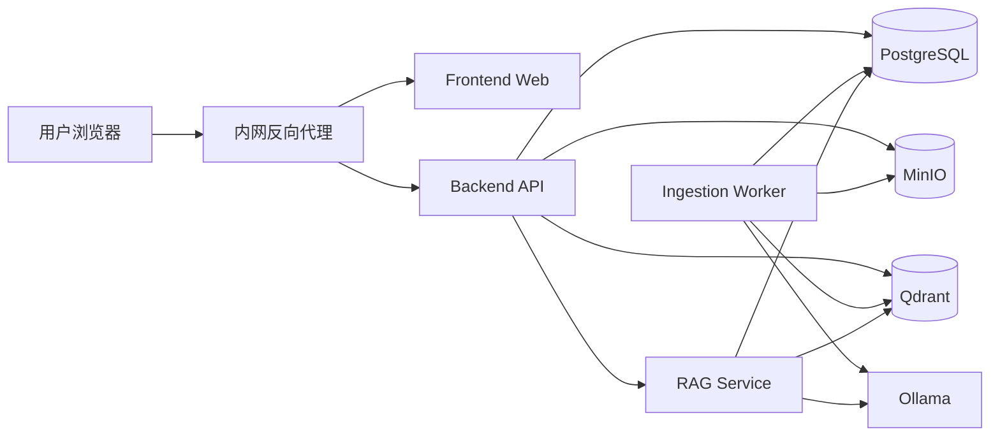
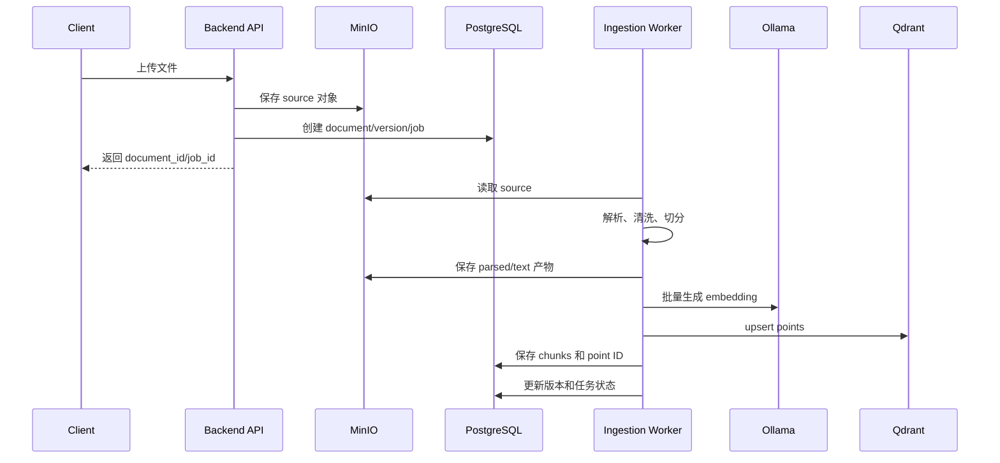
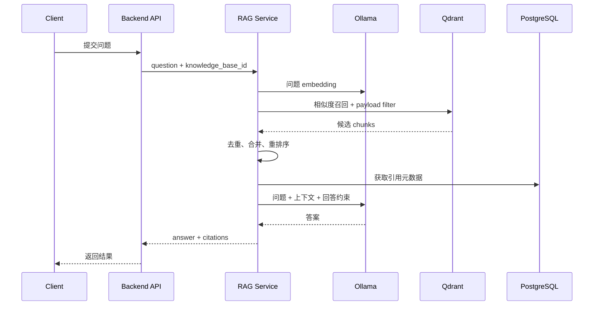

# RAG 知识库问答助手架构设计

## 1. 文档定位

本文档定义系统的正式架构和边界，不描述临时 Demo 实现。

| 项目 | 决策 |
| --- | --- |
| 核心能力 | 企业内部文档的检索增强问答 |
| 向量库 | Qdrant |
| 对象存储 | MinIO |
| 关系数据库 | PostgreSQL |
| 本地模型 | Ollama |
| 开发环境 | 本机 Docker Compose + Ollama |
| 生产环境 | 公司内网服务器 |
| 公网依赖 | 运行时禁止连接公网 |
| Agent | MVP 不引入，采用固定 RAG 流程 |
| 权限 | 暂不实现细粒度权限，但预留数据字段和过滤接口 |

## 2. 目标与边界

### 2.1 目标

1. 管理多个知识库和文档版本。
2. 支持 PDF、Markdown、DOCX，后续扩展网页、Excel 和 OCR。
3. 将原始文件保存到 MinIO，将业务元数据保存到 PostgreSQL，将向量保存到 Qdrant。
4. 通过 Ollama 提供本地 embedding 和 LLM 推理。
5. 返回带文档、章节和页码信息的引用。
6. 支持本机开发后，以同一套服务边界部署到内网服务器。

### 2.2 非目标

- MVP 不实现 Agent 任务规划和外部工具调用。
- MVP 不实现用户、部门、角色级权限控制。
- MVP 不实现知识图谱和复杂多模态推理。
- MVP 不依赖公网模型 API、云对象存储或外部分析平台。

## 3. 总体架构



### 3.1 组件职责

| 组件 | 职责 | 不负责的内容 |
| --- | --- | --- |
| Frontend Web | 知识库管理、文件夹导入、进度展示、问答和引用查看 | 不直接访问数据库、对象存储和向量库 |
| Backend API | 知识库、文档、任务和问答接口 | 不直接实现解析、向量算法和模型推理 |
| Ingestion Worker | 文件解析、清洗、切分、embedding、索引写入 | 不处理用户同步请求 |
| RAG Service | 查询向量化、召回、上下文组装、答案生成 | 不管理原始文件生命周期 |
| PostgreSQL | 知识库、文档、版本、chunk 元数据、任务和会话 | 不保存向量索引 |
| MinIO | 原始文件、解析产物、图片和备份 | 不执行关系查询 |
| Qdrant | dense/sparse 向量和 payload 过滤 | 不保存业务状态 |
| Ollama | 本地 embedding 和 LLM 推理 | 不保存业务数据 |
| Redis/RabbitMQ | 入库任务队列、重试和死信 | MVP 可选，正式异步入库建议使用 |

### 3.2 前端应用设计

前端是独立的 Vue 3 + JavaScript + Vite 应用，开发时运行在本机，生产时构建成静态资源交给内网反向代理或 Nginx 托管。

```text
frontend/
  src/
    app/              路由、应用级配置和布局
    pages/            知识库列表、知识库详情、导入、问答
    components/       文档表格、导入面板、进度条、引用面板
    services/         Backend API 客户端
    state/            页面状态和任务轮询状态
```

前端基础设施建议使用 Vue Router、Pinia 和一个内网可安装的 Vue UI 组件库，例如 Element Plus 或 Naive UI。组件库依赖需要通过本机缓存或内网制品库提供，不能依赖公网 CDN。

前端页面：

1. **知识库列表**：创建、搜索和进入知识库。
2. **知识库详情**：文档列表、文档状态、批量导入入口。
3. **批量导入面板**：选择 ZIP 或目录，显示总文件数、成功数、失败数和失败原因。
4. **问答工作区**：问题输入、答案、引用片段、文档标题和页码。
5. **文档详情**：查看文件名、版本、入库状态和 MinIO 文件链接。

前端只调用 Backend API：

```text
Frontend -> Backend API -> PostgreSQL / MinIO / Qdrant / Ollama
```

不把 MinIO、Qdrant 或 PostgreSQL 地址暴露给浏览器。文件上传由前端提交到 Backend API，再由后端写入 MinIO。

前端 MVP 使用普通 JSON 请求和任务状态轮询；后续可以使用 SSE 推送导入进度和流式回答。前端静态资源不引用公网 CDN、字体或第三方脚本。

## 4. 固定 RAG 与 Agent 的边界

MVP 使用固定 RAG，不需要 Agent：

```text
用户问题
  -> 问题 embedding
  -> Qdrant 召回
  -> 元数据过滤
  -> 上下文组装
  -> Ollama LLM
  -> 答案 + 引用
```

Agent 只有在需要自主选择工具或执行多步任务时才引入，例如同时查询知识库、数据库、工单系统并根据结果决定下一步。未来可以在 RAG Service 之上增加 Agent Orchestrator，但不能用 Agent 替代基础检索链路。

## 5. 数据归属与标识

所有对象通过以下 ID 关联：

```text
knowledge_base_id
  -> document_id
      -> version_id
          -> chunk_id
              -> qdrant_point_id
```

### 5.1 PostgreSQL 保存

核心表：

```text
knowledge_bases
documents
document_versions
document_chunks
ingestion_jobs
conversations
messages
feedback
```

重要字段：

```text
documents.source_object_key       MinIO 对象 Key
documents.content_hash            文件内容哈希
documents.current_version_id      当前有效版本
document_versions.parsed_key      解析结果对象 Key
document_chunks.qdrant_point_id   Qdrant point ID
document_chunks.page_number       引用页码
document_chunks.section_path      章节路径
```

PostgreSQL 是业务状态的唯一来源。文档是否完成、当前版本是哪一个、任务是否失败，都以 PostgreSQL 为准。

### 5.2 MinIO 保存

对象路径：

```text
{knowledge_base_id}/{document_id}/source/{file_name}
{knowledge_base_id}/{document_id}/versions/{version_id}/parsed.json
{knowledge_base_id}/{document_id}/versions/{version_id}/text.json
{knowledge_base_id}/{document_id}/versions/{version_id}/images/page-001.png
```

MinIO 保存原始文件和完整处理产物，应用只在需要解析时读取对象，不依赖本地持久化文件路径。

### 5.3 Qdrant 保存

建议一个 embedding 模型使用一个 collection：

```text
rag_chunks_{embedding_model}
```

Point payload：

```json
{
  "knowledge_base_id": "kb-001",
  "document_id": "doc-001",
  "version_id": "version-002",
  "chunk_id": "chunk-018",
  "title": "差旅报销管理办法",
  "page_number": 3,
  "section_path": "财务制度/差旅报销",
  "is_current": true,
  "text": "差旅费报销需要提交……"
}
```

MVP 检索必须过滤 `knowledge_base_id` 和 `is_current`。权限上线后再增加 `tenant_id`、`department_id`、`visibility` 等过滤字段。

## 6. 文档入库流程



### 6.1 文档处理规则

- PDF 必须保留页码。
- Markdown、HTML、DOCX 尽量保留标题层级。
- 清理重复页眉、页脚、目录和无意义空白。
- 默认按标题、段落和句子切分。
- 默认 chunk 长度 400～800 tokens，重叠 50～120 tokens。
- 每次修改创建新 `version_id`，不覆盖旧版本。

### 6.2 任务状态

```text
uploaded -> parsing -> chunking -> embedding -> indexing -> ready
                                      \-> failed
```

任务必须支持重试。`content_hash` 用于判断重复上传，`chunk_id` 作为幂等写入键。

## 7. 问答检索流程



### 7.1 召回策略

MVP：

- dense embedding 召回 topK 20～50。
- 必须过滤知识库和当前文档版本。
- 最终选择 5～10 个上下文片段。

增强阶段：

- 增加关键词/BM25 或 Qdrant sparse vector。
- 使用 RRF 融合 dense 与 keyword 结果。
- 使用 reranker 对候选片段重新排序。

### 7.2 上下文与回答

上下文必须带来源信息：

```text
[文档] 差旅报销管理办法
[章节] 财务制度/差旅报销
[页码] 3
[内容] ……
```

LLM 约束：

1. 只能依据上下文回答。
2. 上下文不足时明确拒答。
3. 关键结论必须附引用。
4. 不得把推测写成原文事实。

返回结构：

```json
{
  "answer": "……",
  "citations": [
    {
      "document_id": "doc-001",
      "chunk_id": "chunk-018",
      "title": "差旅报销管理办法",
      "page_number": 3,
      "score": 0.86
    }
  ]
}
```

## 8. 服务接口边界

### 8.1 知识库

```text
POST   /api/v1/knowledge-bases
GET    /api/v1/knowledge-bases
GET    /api/v1/knowledge-bases/{id}
PATCH  /api/v1/knowledge-bases/{id}
DELETE /api/v1/knowledge-bases/{id}
```

### 8.2 文档

```text
POST   /api/v1/knowledge-bases/{id}/documents
GET    /api/v1/knowledge-bases/{id}/documents
GET    /api/v1/documents/{id}
GET    /api/v1/documents/{id}/jobs/{job_id}
POST   /api/v1/documents/{id}/reindex
DELETE /api/v1/documents/{id}
```

### 8.3 问答

```text
POST /api/v1/knowledge-bases/{id}/chat
GET  /api/v1/conversations/{id}
POST /api/v1/messages/{id}/feedback
```

API 层只负责参数校验、鉴权入口、事务边界和错误码；解析、召回和模型调用放在服务层。

## 9. 本机开发与服务器部署

### 9.1 本机开发

本机开发是独立环境，不连接公司内网。PostgreSQL、MinIO 和 Qdrant 通过本机 Docker Compose 启动，Ollama 使用本机服务；所有连接地址均指向 `127.0.0.1`。

本机使用 Docker Compose 启动真实基础设施：

```text
postgres
qdrant
minio
redis/rabbitmq
```

Ollama 运行在本机或同一开发网络中。应用使用与生产相同的连接协议和环境变量，只替换地址和凭证。

本机不使用 SQLite、本地向量索引或本地文件作为正式运行路径。没有 Docker/Compose 时只能视为环境未准备好，不能用替代存储冒充正式架构。

### 9.2 服务器部署

```text
员工终端
  -> 内网 HTTPS 反向代理
  -> Backend API
  -> PostgreSQL / MinIO / Qdrant / Ollama
```

服务器部署要求：

- 所有服务部署在公司内网或隔离区。
- 运行时禁止访问公网。
- 不使用公网 LLM API、对象存储、CDN 或在线依赖下载。
- 镜像、模型和依赖通过内网仓库或受控离线介质交付。
- 数据库、Qdrant 和 MinIO 管理端口不暴露给普通用户网段。
- 只有反向代理对用户开放 443。

## 10. 配置边界

```text
DATABASE_URL
QDRANT_URL
QDRANT_COLLECTION
MINIO_ENDPOINT
MINIO_ACCESS_KEY
MINIO_SECRET_KEY
MINIO_BUCKET
OLLAMA_URL
OLLAMA_CHAT_MODEL
OLLAMA_EMBEDDING_MODEL
RAG_TOP_K
RAG_FINAL_K
```

配置通过根目录 `.env`、服务器 Secret 或环境变量注入，代码不写死服务器地址和凭证。

## 11. 一致性、备份与恢复

### 11.1 写入一致性

入库完成的判定顺序：

1. MinIO source 写入成功。
2. PostgreSQL 创建版本和任务。
3. Qdrant points 写入成功。
4. PostgreSQL 写入 chunk 与 point ID。
5. PostgreSQL 将版本标记为 `ready`。

任何中间步骤失败，版本保持非 `ready`，任务进入 `failed` 或等待重试。

### 11.2 备份

- PostgreSQL：定期逻辑备份和恢复演练。
- MinIO：对象版本、跨盘复制或备份存储。
- Qdrant：定期 snapshot，并记录对应 embedding 模型和 collection 配置。
- 备份必须保留校验和，不能只检查备份文件是否生成。

## 12. 观测与评估

每次问答记录：

```text
request_id
knowledge_base_id
question
retrieved_chunk_ids
retrieval_scores
model_name
prompt_tokens
completion_tokens
latency_ms
```

核心指标：

- 入库成功率和失败原因
- Qdrant 召回延迟
- LLM 首 token 延迟和总耗时
- 无答案率
- 引用准确率
- Recall@K、MRR/NDCG
- 用户反馈

## 13. 实施顺序

### Phase 1：正式本机基础设施

- Docker Compose 启动 PostgreSQL、Qdrant、MinIO、Redis。
- Ollama 接入本地 chat 和 embedding 模型。
- 完成文档上传、解析、切分、索引和带引用问答。

### Phase 2：质量增强

- 混合检索。
- reranker。
- 文档版本重建和索引清理。
- 离线评估集和反馈闭环。

### Phase 3：内网上线

- 内部 DNS、HTTPS、反向代理和监控。
- 内网镜像仓库、模型仓库和离线升级流程。
- 备份恢复、审计和容量规划。

### Phase 4：权限与 Agent

- 多租户和细粒度文档权限。
- 按需引入 Agent Orchestrator 和业务工具调用。

## 14. 架构验收标准

1. 运行时只使用 PostgreSQL、MinIO、Qdrant 和 Ollama，不存在 SQLite 或本地向量索引依赖。
2. 原始文件能通过 MinIO 对象 Key 找回。
3. 每个 Qdrant point 都能关联到 PostgreSQL 的 `chunk_id`、文档和版本。
4. 文档更新后，旧版本不会参与默认召回。
5. 问答返回答案和可定位的引用。
6. 任一基础设施不可用时，系统明确报告组件故障，不静默切换到另一套存储。
7. 本机和服务器使用同一套服务边界，仅通过配置切换地址、凭证和资源规格。
